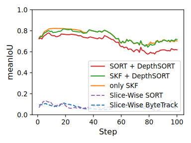

# Sliced Multi Object Tracker 

## Updates
- 25/03/01 Add `predict.py` and outputs including text-outputs, visualizations and evaluations.
- 25/02/24 Change procedure of installation to adapt the non-support of pytorch for conda installation. (see https://pytorch.org/get-started/locally/)
- 25/02/22 Initial release.

## Performance
<p align="center">
  
  <br>
  Solid lines indicate performance of proposed method while dased lines indicate ones of arranged existing methods.
</p>

## Installation
```
conda create -n SMOT python=3.10
conda activate SMOT
pip install torch torchvision torchaudio --index-url https://download.pytorch.org/whl/cu126
pip install ultralytics huggingface_hub 
```
Please pay attention to installation order because installation of ultralytices updates numpy's version that has installed at one of pytorch. 

## Validation
Run validation on default settings.
```
python valid.py --ns 101 --nf 101
```
where `ns` means number of slice and `nf` means number of frames. 

If you use custom dataset, please run
```
python valid.py --ns {ns} --nf {nf} --input {your/dataset/root/path} --dv [dx,dy,dz]
```
where `dv` means scale ratio of state-space from observe-space.

And you can select the mode by 
```
python valid.py --ns {ns} --nf {nf} --mode {SD/K/KD}
```
- SD: Use 2D-like kalman filter to predict bboxes and leverage DepthSORT to get re-identified bboxes.
- K: Use only 3D-like kalman filter to predict and to estimate. (So don't use DepthSORT.)
- KD: Use 3D-like kalman filter to predict bboxes and leverage DepthSORT to get re-identified bboxes.

About other options, please see the function `parse_hyp()` on `valid.py`.

## Prediction